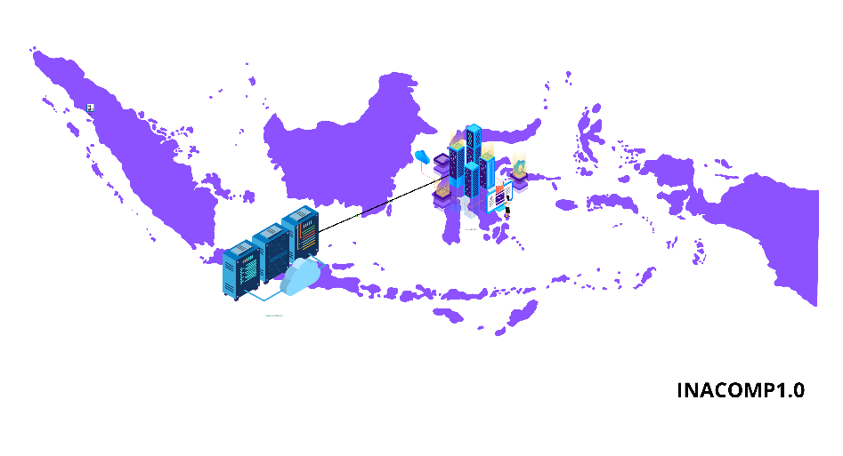
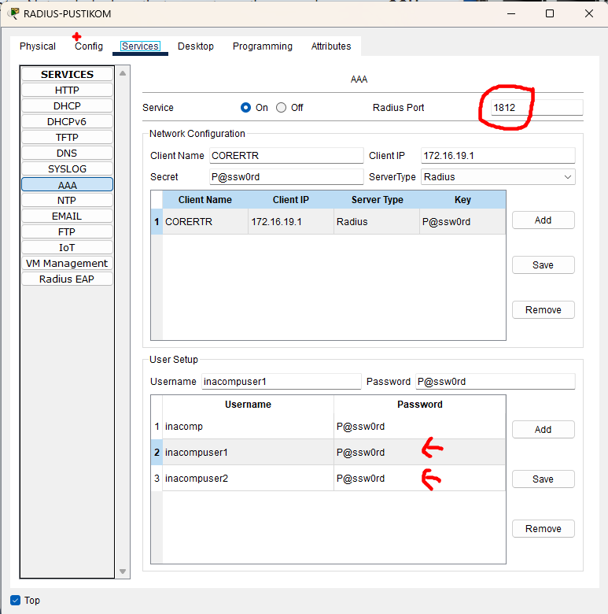

# INACOMP FINAL
## SOAL
In this test project, you need to solve the network & system problems. \
Use the below information as your guidance. Here are the tiny notes. \
It needs your skill to explore the existing configuration to make the network & system are serving again as expected. \
Engineer network & system notes:  
```bash
HA ID: 1 & 2 
Domain: inacomp.site 
Some system is the below credentials: 
Username: ftpinacomp, inacompuser1, inacompuser2 
Password: P@ssw0rd 
```

## Topology
[](./topology.md)

## Problem
NB: You have 7 problems. Please, use your time wisely. 
1. There is a problem with the VOICE networks. Somehow all IP Phone does not call each 
other it's better to check right now, what happened, and fix it. 
2. Please check to make sure that only Admin-PC can connect to his switch, don't let another 
PC use that port. 
3. Warrior of the Net can't access Public-FTP. 
4. The communication between APP1 servers & APP2 servers must be encrypted (AES), some 
configurations were configured, but currently don't work, please complete making it work. 
5. Warrior of the Net can't SSH access to the CORERTR and it should always authenticate the 
centralized server. 
6. After some system migration, currently, the MAIL Server does not work also. Please spot the 
server and test in the PC client. 
7. There is an issue also with High Availability on NAT-Gateway. Make sure the IP address 
10.200.200.254 can be used for HA.

## SOLVE
### Problem 1
IP Phone Tidak Bisa Saling Menelepon di VOICE Networks (Sulawesi > VOICE-NETWORKS)
#### LAPTOP MANAGED > cmd (remote the TELEPHONY-SERVICE)
```bash
C:\>ssh -l userinacomp1 99.99.99.1
# pass: P@ssw0rd

TELEPHONY-SERVICE(config)#ip dhcp pool VOICE-NETWORKS
TELEPHONY-SERVICE(dhcp-config)#default-router 10.100.100.1
TELEPHONY-SERVICE(dhcp-config)#option 150 ip 10.100.100.1
TELEPHONY-SERVICE(dhcp-config)#telephony-service 
TELEPHONY-SERVICE(config-telephony)#max-ephones 12
TELEPHONY-SERVICE(config-telephony)#auto assign 1 to 12
```

#### LAPTOP MANAGED > Console the SW-VOICE
```bash
SW-VOICE(config)#int gig 0/1
SW-VOICE(config-if)#sw mode tr

SW-VOICE(config-if)#int ra fa 0/1-5
SW-VOICE(config-if-range)#sw voice vlan 100
SW-VOICE(config-if-range)#no sw acc vlan 100
```

#### Verifikasi
The VOICE network is now working properly, and all IP Phones can call each other.
```#do sh run | sec ephone | include mac```


### Problem 2
Batasi Akses Port Switch Hanya untuk Admin-PC (Sulawesi > VOICE-NETWORKS)

#### Admin-PC > Console the SW-DATA
```bash
# vtp domain miss name
SW-DATA(config)#vtp domain inacomp1.0
```

#### Admin-PC > CMD > Check the MAC-Address
```bash
ipconfig /all
FastEthernet0 Connection:(default port)
   Connection-specific DNS Suffix..: 
   Physical Address................: 00E0.B016.6C52
```

#### Admin-PC > Console the SW-DATA
```bash
SW-DATA(config-if)#do sh run | sec interface FastEthernet0/2
interface FastEthernet0/2
 switchport access vlan 200
 switchport mode access
 switchport port-security
 switchport port-security maximum 2

# change the maximum and add the mac address
switchport port-security mac-addres  00E0.B016.6C52
switchport port-security maximum 1
```

#### Verifikasi
The Admin-PC can only access the VOICE-NETWORKS network, and the MAC-Address


### Problem 3
Warrior of the Net Tidak Bisa Mengakses Public-FTP. (Jawa > Wariior of the Net & Sulawesi > DATA-NETWORKS)

#### Warrior-of-the-Net > Console the CORERTR-PUSTIKOM
```bash
CORERTR-PUSTIKOM(config)#ip route 0.0.0.0 0.0.0.0 201.202.203.15
```

#### Public-FTP > Service
- enable the ftp service, and add the user ftpinacomp:P@ssw0rd with perm RWDNL (full)
  

#### Warrior-of-the-Net > IP-Address
- change the IP-Address to 201.202.203.20/25 with gateway 201.202.203.10
  
  

#### Laptop 3 > Console the FTP-FW1
```bash
FW1#show run
interface GigabitEthernet1/1
 nameif outside
 security-level 0
 ip address 201.202.203.15 255.255.255.128
interface GigabitEthernet1/2
 nameif inside
 security-level 100
 ip address 10.192.168.1 255.255.255.0

object network SRV1
 host 10.192.168.10
object network SRV2
 host 10.192.168.11
 nat (inside,outside) static 201.202.203.15

route outside 0.0.0.0 0.0.0.0 201.202.203.10 1
access-list FTP-SERVICE extended permit tcp 201.202.203.0 255.255.255.128 host 10.192.168.11 eq ftp
```
kita perlu menambahkan access-group

```bash
FW1(config)#access-group FTP-SERVICE in interface outside
```

- setelah saya nmelihat configurasi firewall saya menyimpulkan bahwa public ftp dia di nat jadi kita bisa akses ftp server dengan ip public fw nya
  

### Problem 4
Komunikasi APP1 ↔ APP2 Harus Terenkripsi (AES) (Sulawesi > APP1-Networks & APP2-Networks)
#### APP1-Networks > SRV
```bash
C:\>ssh -l inacompuser1 201.202.203.14
# pass: P@ssw0rd

APPR1(config)#do sh r | sec crypto
crypto isakmp policy 1
 authentication pre-share
 group 2
crypto isakmp key 0 address 201.202.203.16
crypto ipsec security-association lifetime seconds 86400
crypto ipsec transform-set SECURECONNECT esp-aes esp-sha-hmac
crypto map IPSECWAN 100 ipsec-isakmp 
 ! Incomplete
 set peer 201.202.203.16
 set pfs group2
 set security-association lifetime seconds 86400
 set transform-set SECURECONNECT 
 match address SECURED-TRAFFIC
 crypto map IPSECWAN

APPR1(config)#do sh run
interface FastEthernet0/0
 ip address 201.202.203.14 255.255.255.128
 ip nat outside
 duplex auto
 speed auto
 crypto map IPSECWAN
interface FastEthernet0/1
 ip address 192.168.1.1 255.255.255.0
 ip nat inside
 duplex auto
 speed auto
ip nat inside source static 192.168.1.20 201.202.203.51 
ip route 192.168.200.0 255.255.255.0 201.202.203.16 
ip access-list extended SECURED-TRAFFIC

APP2-RTR(config)#do sh r | sec crypto
crypto isakmp policy 1
 authentication pre-share
 group 2
crypto isakmp key 0 address 201.202.203.14
crypto ipsec security-association lifetime seconds 86400
crypto ipsec transform-set SECURECONNECT esp-aes esp-sha-hmac
crypto map IPSECWAN 100 ipsec-isakmp 
 ! Incomplete
 set peer 201.202.203.14
 set pfs group2
 set security-association lifetime seconds 86400
 set transform-set SECURECONNECT 
 match address SECURED-TRAFFIC

APP2-RTR(config)#do sh r
interface FastEthernet0/0
 ip address 201.202.203.16 255.255.255.128
 duplex auto
 speed auto
interface FastEthernet0/1.200
 encapsulation dot1Q 200
 ip address 192.168.200.1 255.255.255.0

ip route 192.168.1.0 255.255.255.0 201.202.203.14 !
ip access-list extended SECURED-TRAFFIC
```
jika dilihat ternyata ada yang masih incompleate.
dan jika dilihat di fa 0/0 APP2-RTR kurang crypto map nya
```bash
APP2-RTR(config)#int fa 0/0
APP2-RTR(config-if)# crypto map IPSECWAN
*Jan  3 07:16:26.785: %CRYPTO-6-ISAKMP_ON_OFF: ISAKMP is ON
```
disini terlihat terdapat acl hanya saja belum selesai jadi kita perlu menambahkanya
```bash
APPR1(config-if)#ip access-list extended SECURED-TRAFFIC
APPR1(config-ext-nacl)# permit ip 192.168.1.0 0.0.0.255 192.168.200.0 0.0.0.255

APP2-RTR(config-if)#ip access-list extended SECURED-TRAFFIC
APP2-RTR(config-ext-nacl)# permit ip 192.168.200.0 0.0.0.255 192.168.1.0 0.0.0.255
```

### Verifikasi
masing masing Routuer APP berhasil terenkripsi


### Problem 5
Warrior of the Net Tidak Bisa SSH ke CORERTR + Harus Gunakan Otentikasi Terpusat ()
#### Warrior-of-the-Net > Console the CORERTR-PUSTIKOM
```bash
CORERTR-PUSTIKOM(config)#do sh r
username localuser password 0 P@ssw0rd
ip ssh version 2
radius server 172.16.19.10
 address ipv4 172.16.19.10 auth-port 1812
 key P@ssw0rd
line vty 0 4
 login authentication RADIUS-AUTH
 transport input telnet
```
memperbaiki tarnsport input
```bash
CORERTR-PUSTIKOM(config)#line vty 0 4
CORERTR-PUSTIKOM(config-line)#transport input ssh
```
lalu saya coba mengecek radius server dan melihat configurasinya ternyata terdapat kesalahan pada port, dan user setup nya belum ditambahkan


#### Verifikasi


### Problem 6
MAIL Server Tidak Berfungsi Pasca Migrasi Sistem (APP1-Networks)
#### DNS Server > DNS
- aktifkan DNS Server, dan tambahkan A Record DNS mengarah ke email server
  
- dan pastikan berhasil melakukan nslookup
  

#### PC 0, dan PC 1
memperbaiki ingoing dan outgoing mail server karena PC 0 tidak sesuai ubah menjadi mail.inacomp.site


#### Verifikasi


### Problem 7
Masalah High Availability pada NAT-Gateway (IP 10.200.200.254) (Sulawesi > VOICE-NETWORKS)

#### Admin-PC > Console the NAT-GATEWAY1 & NAT-GATEWAY2
```bash
NAT-GATEWAY1(config)#do show run | sec int
interface GigabitEthernet0/0.100
 encapsulation dot1Q 100
 ip address 10.100.100.201 255.255.255.0
 standby 1 ip 10.100.100.254
interface GigabitEthernet0/0.200
 encapsulation dot1Q 200
 ip address 10.200.200.201 255.255.255.0
 ip nat inside

NAT-GATEWAY1(config)#int gig 0/0.200
NAT-GATEWAY1(config-subif)#standby 2 ip 10.200.200.254

NAT-GATEWAY2(config)#do sh run | sec int
interface GigabitEthernet0/0.100
 encapsulation dot1Q 100
 ip address 10.100.100.202 255.255.255.0
 ip nat inside
 standby 1 ip 10.100.100.254
interface GigabitEthernet0/0.200
 encapsulation dot1Q 200
 ip address 10.200.200.202 255.255.255.0
 ip nat inside

NAT-GATEWAY2(config)#int gig 0/0.200
NAT-GATEWAY2(config-subif)#standby 2 ip 10.200.200.254
```

#### Verifikasi
The HSRP is active, and Admin-PC can ping the gateway

