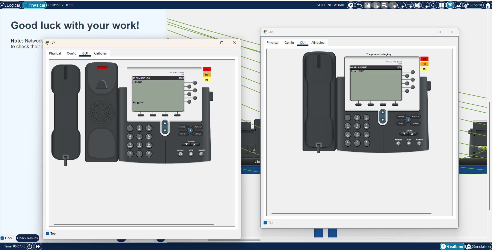
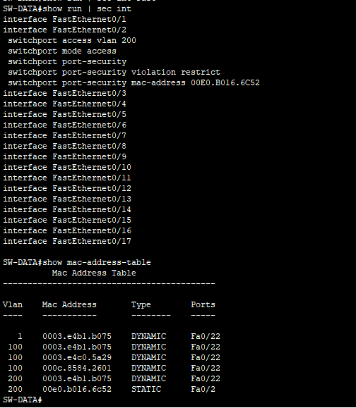
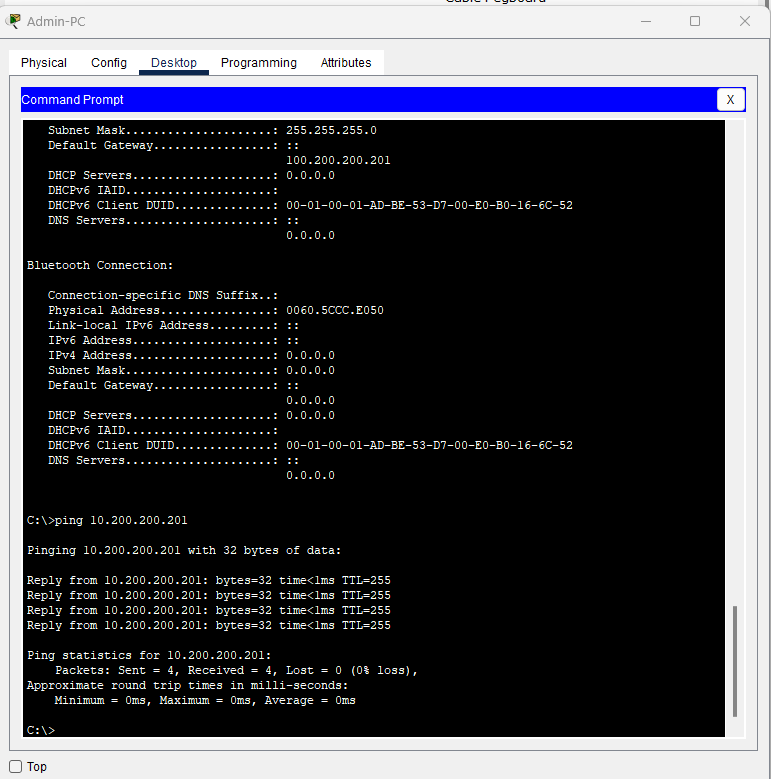
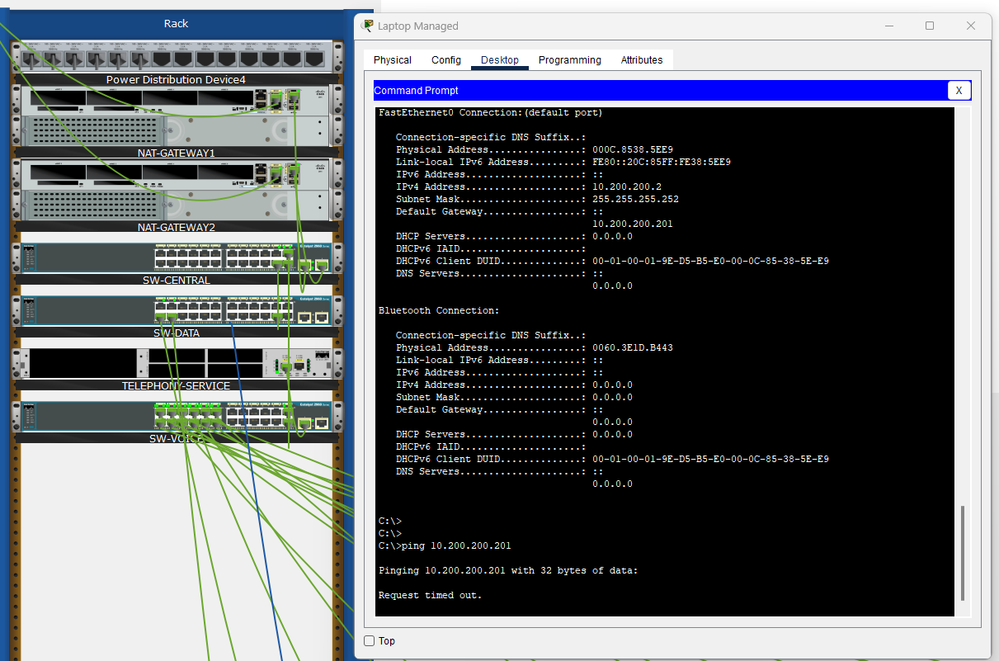
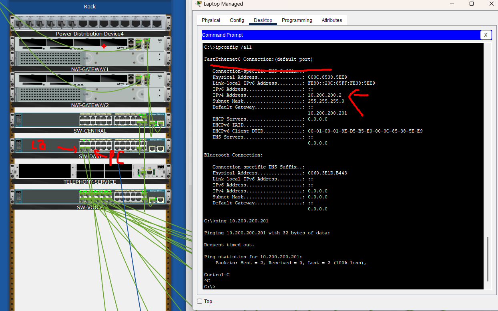
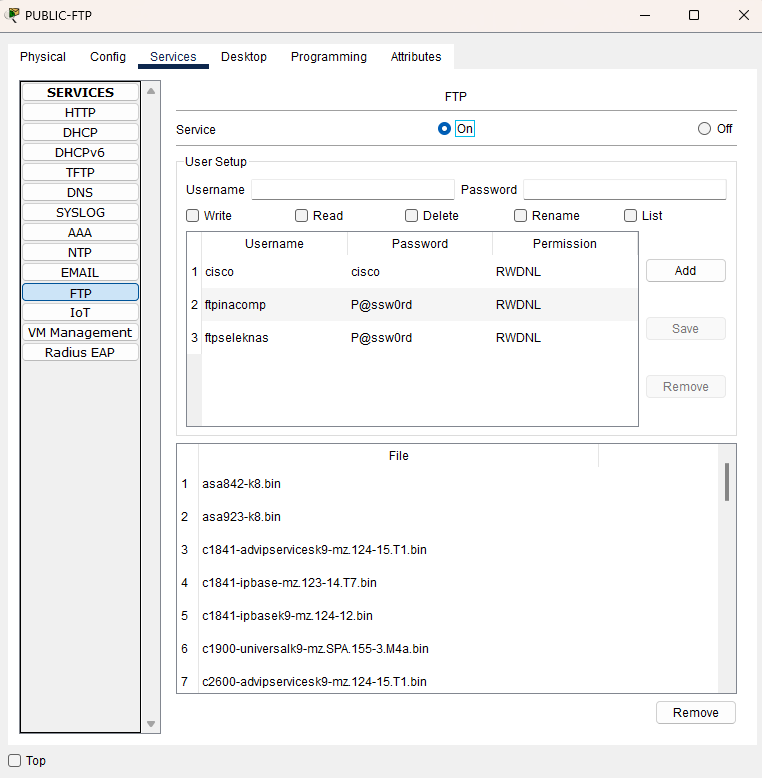
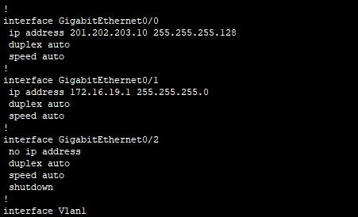
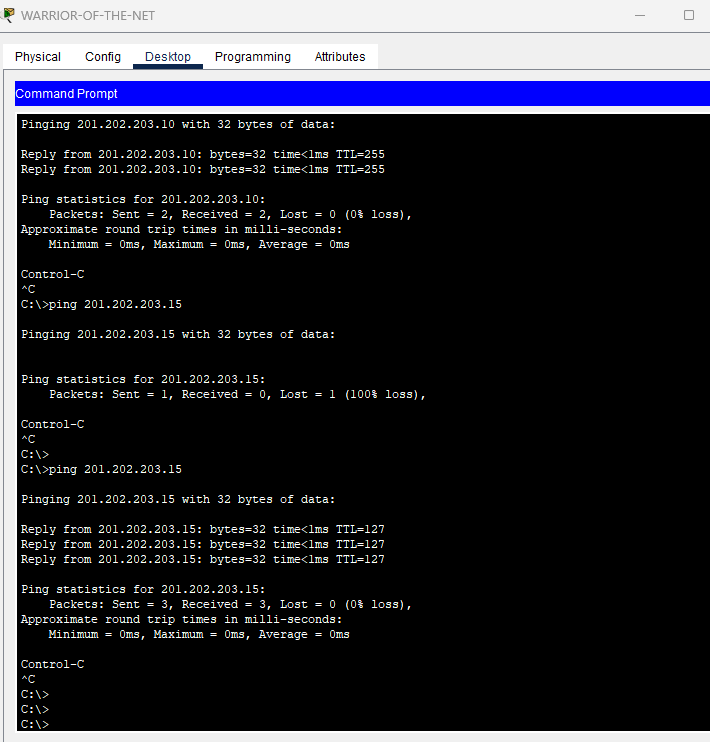
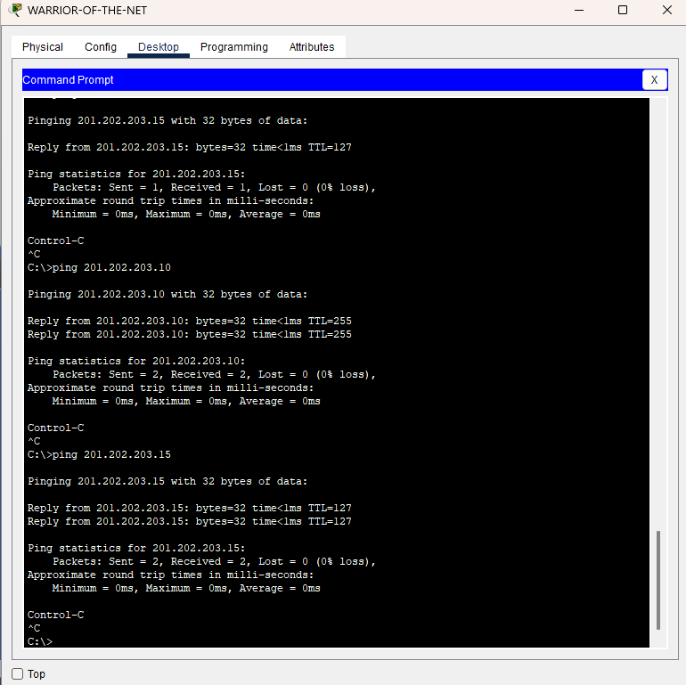
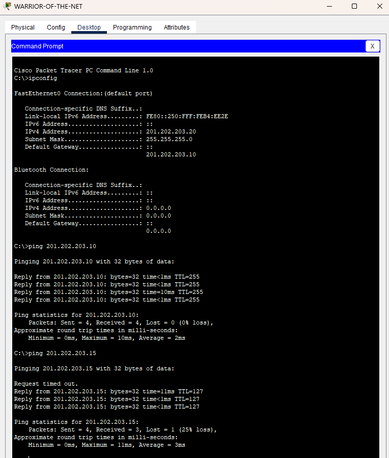

# INACOMP FINAL
## Ticket 1
### config
```
TELEPHONY-SERVICE(config)#ip dhcp pool VOICE-NETWORKS
TELEPHONY-SERVICE(dhcp-config)#default-router 10.100.100.1
TELEPHONY-SERVICE(dhcp-config)# option 150 ip 10.100.100.1
TELEPHONY-SERVICE(config)#telephony-service 
TELEPHONY-SERVICE(config-telephony)#max-ephones 12
TELEPHONY-SERVICE(config-telephony)#auto assign 1 to 12

SW-VOICE(config)#int gig 0/1
SW-VOICE(config-if)#sw mode tr

SW-VOICE(config-if)#
SW-VOICE(config-if)#int ra fa 0/1-5
SW-VOICE(config-if-range)#sw voice vlan 100
SW-VOICE(config-if-range)#no sw acc vlan 100
```

### result



## Ticket 2
```bash
SW-DATA(config)#int fa 0/2
SW-DATA(config-if)#switchport port-security 
SW-DATA(config-if)#switchport port-security mac-address 00E0.B016.6C52
SW-DATA(config-if)#switchport port-security maximum 1
SW-DATA(config-if)#switchport port-security violation restrict      
```
- ubah default gateway pada pc admin dengan ip NAT_GATEWAY yaitu 10.200.200.201 atau 10.200.200.202 agar berhasil melakukan ping





## ticket 3
- sulawesi > data network > ftp enablin
- jawa > dc > laptop warior tambahkan default gateway ke arah CORERTR-PUSTIKOM dengan ip 201.202.203.10
- lalu tambahkan default route ke 201.202.203.15
```bash
CORERTR-PUSTIKOM(config)#ip route 0.0.0.0 0.0.0.0 201.202.203.15 
```







ss ping 

