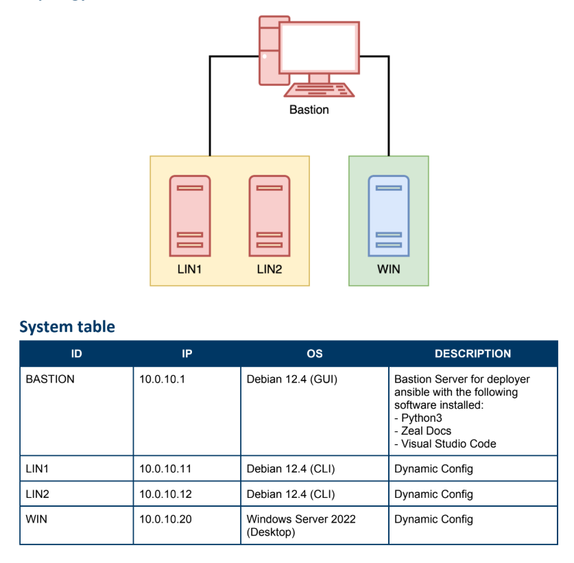

# nama_soal
## soal
- [soal.pdf](./LKS_PROVINSI_2024_ITNSA_MB_actual_en.pdf)
- [users.csv_sample](./workfolder/users.csv)

## topologi


## configuration
### setup repository di LIN1, LIN2, dan BASTION
- sebelum configurasi repo, pastikan sudah bisa mengakses internet.
- ubah configuration repo debian 
  ```nano /etc/apt/sources.lists```
  ```bash
  deb https://ftp.debian.org/debian/ bookworm contrib main non-free non-free-firmware
  deb https://ftp.debian.org/debian/ bookworm-updates contrib main non-free non-free-firmware
  deb https://security.debian.org/debian-security/ bookworm-security contrib main non-free non-free-firmware
  ```
  > configurasi debian ini tergantung dengan versi yang digunakan, dan url repo juga tergantung repo yang aktif. (bisa cari di google)
- setelah melakukan configursi tersebut pastikan bisa melakukan apt update

### installasi ansible dan package pendukung di BASTION
```bash
# bastion
apt install pipx ansible sshpass curl
ansible -v
```

### setup openssh server pada LIN1, dan LIN2
- Instalasi OpenSSH Server di LIN1 dan LIN2
  ```bash
  sudo apt install openssh-server net-tools
  ```
  > net-tools bersifat opsional, tapi berguna untuk mengecek port SSH (port 22) aktif dengan netstat -tulnp.
- Edit Konfigurasi sshd_config
  - Edit file konfigurasi OpenSSH:
    ```bash
    sudo nano /etc/ssh/sshd_config
    ```
  - Cari baris:
    ```bash
    #PermitRootLogin prohibit-password
    ```
  - Ubah menjadi (jangan lupa hapus # di awal baris untuk mengaktifkan konfigurasi):
    ```bash
    PermitRootLogin yes
    ```
  - Default-nya, root login dilarang (atau hanya boleh dengan public key). 
    > Mengubah ke PermitRootLogin yes memperbolehkan login sebagai root via password (pastikan root punya password).
<!-- - mengaktifkan OpenSSH Server
  ```bash
  sudo systemctl enable --now ssh
  ```
  > --now digunakan untuk melakukan enable sekaligus start -->
- melakukan restart OpenSSH Server jika ingin mengubah konfigurasi
  ```bash
  sudo systemctl restart ssh
  ```

### setup openssh server pada WIN
- steps 1
  ```bash
  comming soon
  ```

## Ansible – Automation via SSH
### configurasi ansible aria generate by Chat GPT (opsional jika ingin cuma run aja)
- clone repository ini dan masuk ke ITNSA, modul B
  ```bash
  cd /tmp
  git clone https://github.com/ariafatah/a_1
  cd a_1

  cp -rf ITNSA/B/workfolder /home/user
  ```
- jika user / directory /home/user tidak ditemukan buat terlebih dahulu dengan menggunakan ```useradd user```, dan ```passwd user``` untuk mengubah password user (opsional)
- setelah melakukan clone masuk ke directory ```/home/user/workfolder```, dan jangan lupa ubah hosts menjadi ip yang sesuai dengan server yang ingin di konfig nantinya
  ```bash
  cd /home/user/workfolder
  nano hosts
  ## dan sesuaikan ip nya

  nano linux/2-dns-server.yml
  ## ubah dan sesuaikan
  dns_servers:
    - "10.0.10.11"
    - "10.0.10.12"
  
  nano linux/3-dns-client.yml
  ## ubah dan sesuaikan
  dns_servers:
    - "10.0.10.11"
    - "10.0.10.12"
  ```

### Test koneksi SSH dengan Ansible
```bash
ansible linux -i /home/user/workfolder/hosts -m ping

# atau jika ingin menggunakan semua ip di inventory
ansible all -i /home/user/workfolder/hosts -m ping
```
Penjelasan:
- **linux** → nama group host yang didefinisikan di file hosts.
- **all** → untuk semua host yang didefinisikan di file hosts.
- **-i** → menunjukkan path ke file inventory hosts.
- **-m ping** → menjalankan module ping Ansible (bukan ICMP, tapi tes koneksi & autentikasi via SSH).

### Menjalankan Playbook Ansible
```bash
# LIN*
ansible-playbook /home/user/workfolder/linux/1-hostname.yml -i /home/user/workfolder/hosts
ansible-playbook /home/user/workfolder/linux/2-dns-server.yml -i /home/user/workfolder/hosts
ansible-playbook /home/user/workfolder/linux/3-dns-client.yml -i /home/user/workfolder/hosts
ansible-playbook /home/user/workfolder/linux/4-web-server.yml -i /home/user/workfolder/hosts
ansible-playbook /home/user/workfolder/linux/5-users.yml -i /home/user/workfolder/hosts

# WIN
ansible-playbook /home/user/workfolder/windows/1-hostname.yml -i /home/user/workfolder/hosts
ansible-playbook /home/user/workfolder/windows/2-sec-log.yml -i /home/user/workfolder/hosts
ansible-playbook /home/user/workfolder/windows/3-dns-client.yml -i /home/user/workfolder/hosts
ansible-playbook /home/user/workfolder/windows/3-dns-server.yml -i /home/user/workfolder/hosts
ansible-playbook /home/user/workfolder/windows/4-web-server.yml -i /home/user/workfolder/hosts
```
> Pastikan struktur direktori dan nama file sesuai.

## test configurasi LIN1, LIN2 (opsional)
```bash
# 1-hostname.yml
hostname # melihat apakah konfigurasi hostname sudah berhasil

# 2-dns-server.yml
systemctl status named # melihat service dns sudah berjalan
cat /etc/bind/zones/db.linux.com # melihat zone db linux.com

# 3-dns-client.yml
cat /etc/resolv.conf
nslookup linux.com
nslookup lin1.linux.com
nslookup lin2.linux.com

# 4-web-server.yml
apt install curl
curl lin1.linux.com # or use ip use the 10.1.10.11
curl lin2.linux.com # or use ip use the 10.1.10.12

# 5-users.yml
cat /etc/passwd
ls /home
```

## test configurasi WIN (opsional)
```bash
comming soon
```