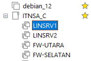
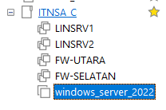
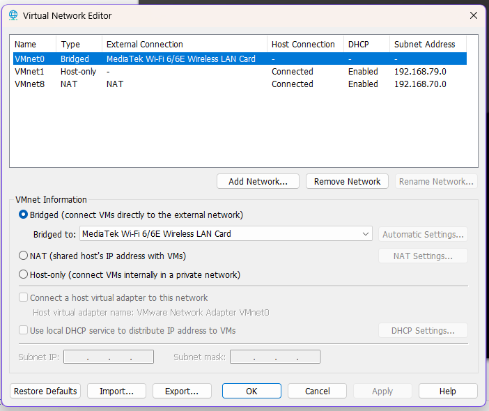
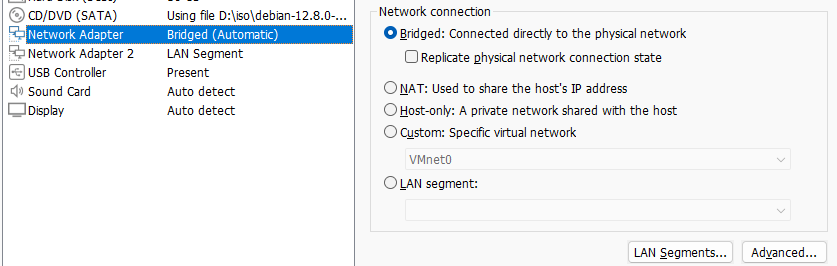
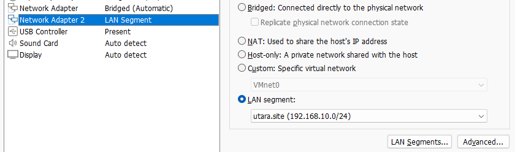
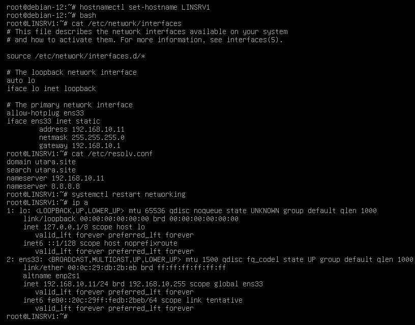
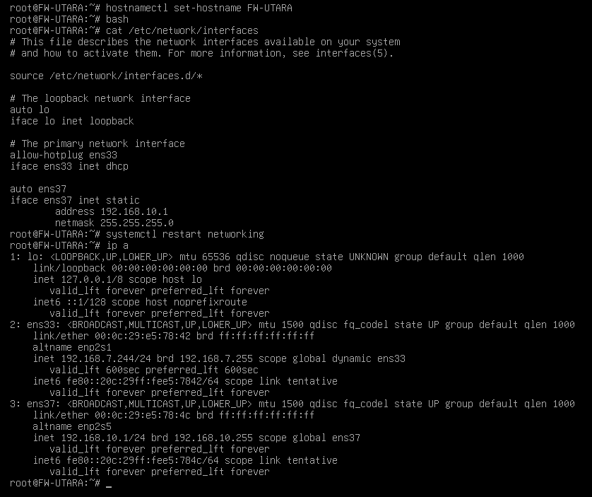

# setup
## install require app
- [debian_12_netinst.iso](#)
- [windows_server_2022_evaluation](https://www.microsoft.com/en-us/evalcenter/download-windows-server-2022)
- [vmware workstation pro](https://support.broadcom.com/group/ecx/downloads)

## create vm
- install vmware workstation pro (btw harus login dulu jika ingin download)
- siapkan iso windows server dan debian 12 nya
- buat 1 vm debian dan lakukan installasi sampai bisa kebuka setelah berhasil. shutdown vm
- clone vm debian menjadi 4 dan ubah namanya menjadi seperti ini
  
- setelah itu install vm windows server
  
  > jangan lupa ubah settinganya di options > advance > firmware type nya diubah menjadi BIOS

## setup network adaptor
- buat bridge dengan wireless atau adaptor lan biar bisa konek ke jaringan lokal di **virtual network editor**
  
- setelah itu atur network menjadi seperti ini
  - FW-UTARA 
    - network adaptor 1 = bridge (harus ubah dulu di network editor dan sesuaikan ke interface yang ingin di bridge)
      
    - network adaptor 2 = LAN_SEGMENT ( utara.site (192.168.10.0/24) )
       
  - LINSRV1
    - network adaptor 1 = LAN_SEGMEN ( utara.site (192.168.10.0/24) )
  - LINSRV2
    - network adaptor 1 = LAN_SEGMEN ( utara.site (192.168.10.0/24) )
  - FW-SELATAN
    - network adaptor 1 = bridge
    - network adaptor 2 = LAN_SEGMENT ( selatan.site (172.16.20.0/24) )
  - WINSRV
    - network adaptor 1 = LAN_SEGMENT ( selatan.site (172.16.20.0/24) )
- setelah setup network adaptor jangan lupa untuk melakukan snapshoot agar mempermudah jika ingin mencoba lagi

## setup hostname, repository
- power on LINCLI, LINSRV1, LINSRV1, FW-UTARA, FW-SELATAN terlebih dahulu
- setelah itu coba ping internet dengan VM FW jika sudah berarti sudah aman
- ubah hostname di tiap vm
  ```bash
  hostnamectl set-hostname <nama>
  ```
- setup repository di repository.list
  ```bash
  sudo mkdir /media/debian2
  mount /dev/sr0 /media/debian2
  sudo apt-cdrom add
  ```

## setup LINSRV1
 \
- ubah hostname menggunakan hostnamectl atau ubah di /etc/hostname
  ```bash
  hostnamectl set-hostname LINSRV1

  # atau ubah di /etc/hostname
  echo LINSRV1 > /etc/hostname

  ## reload
  bash
  ```
- tambahkan ip address di /etc/network/interfaces
  ```nano /etc/network/interfaces``` \
  tambahkan bagian ini
  ```bash
  iface ens33 inet static
        address 192.168.10.11
        netmask 255.255.255.0
        gateway 192.168.10.1
  ```
- tambahkan dns nameserver di /etc/resolv.conf
  ```nano /etc/resolv.conf``` \
  ubah menjadi seperti ini \
  ```bash
  domain utara.site
  search utara.site
  nameserver 192.168.10.1
  nameserver 8.8.8.8
  ```
- lakukan restart service networking
  ```bash
  systemctl restart networking
  ```

## setup LINSRV2
- ubah hostname menggunakan hostnamectl atau ubah di /etc/hostname seperti LINSRV1
  ```hostnamectl set-hostname LINSRV2```
- untuk ip karena dhcp static dan secara default interface ens33 sudah dhcp jadi tidak perlu
- tambahkan dns nameserver di /etc/resolv.conf seperti LINSRV1
  ```nano /etc/resolv.conf``` \
  ubah menjadi seperti ini \
  ```bash
  domain utara.site
  search utara.site
  nameserver 192.168.10.1
  nameserver 8.8.8.8
  ```
- lakukan restart service networking
  ```bash
  systemctl restart networking
  ```

## setup LINCLI
- ubah hostname menggunakan hostnamectl atau ubah di /etc/hostname seperti LINSRV1
  ```hostnamectl set-hostname LINCLI```
- untuk ip karena dhcp static dan secara default interface ens33 sudah dhcp jadi tidak perlu
- tambahkan dns nameserver di /etc/resolv.conf seperti LINSRV1
  ```nano /etc/resolv.conf``` \
  ubah menjadi seperti ini \
  ```bash
  domain utara.site
  search utara.site
  nameserver 192.168.10.1
  nameserver 8.8.8.8
  ```
- lakukan restart service networking
  ```bash
  systemctl restart networking
  ```

## setup FW-UTARA

- ubah hostname menggunakan hostnamectl atau ubah di /etc/hostname seperti LINSRV1
  ```hostnamectl set-hostname FW-UTARA```
- tambahkan ip address di /etc/network/interfaces di interface ens37 karena ens33 dipake untuk ke bridge / menghubugnkan ke FW-SELATAN
  ```nano /etc/network/interfaces``` \
  tambahkan bagian ini
  ```bash
  auto ens37
  iface ens37 inet static
        address 192.168.10.1
        netmask 255.255.255.0
  ```
- lakukan restart service networking
  ```bash
  systemctl restart networking
  ```

## setup FW-SELATAN
- ubah hostname menggunakan hostnamectl atau ubah di /etc/hostname seperti LINSRV1
  ```hostnamectl set-hostname FW-SELATAN```
- tambahkan ip address di /etc/network/interfaces di interface ens37 karena ens33 dipake untuk ke bridge / menghubugnkan ke FW-UTARA
  ```nano /etc/network/interfaces``` \
  tambahkan bagian ini
  ```bash
  auto ens37
  iface ens37 inet static
        address 172.16.20.1
        netmask 255.255.255.0
  ```
- lakukan restart service networking
  ```bash
  systemctl restart networking
  ```