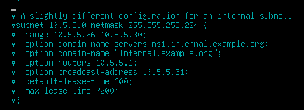
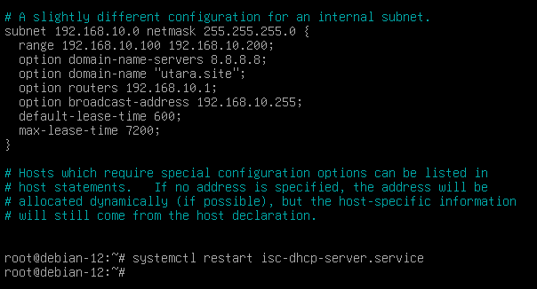
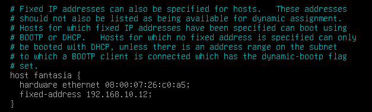

<!-- # setup dhcp server
## setup FW-UTARA
- install isc-dhcp-server 
  ```bash
  apt install isc-dhcp-server
  ```
- setup interface dhcp server \
  ```nano /etc/default/isc-dhcp-serve``` \
  ubah bagian ini \
  ```bash
  INTERFACESv4="<ens37>"
  ```
- configurasikan dhcp server \
  ```nano /etc/dhcp/dhcpd.conf``` \
  cari baris ini \
  
  uncommant semuanya dan ubah sesuai dengan network yang kita gunakan
  
- tambahkan dhcp static
  
  ```bash
  host client-pc {
    hardware ethernet 08:00:27:4a:2f:45;  # MAC address client
    fixed-address 192.168.1.100;          # IP yang akan diberikan
  }
  ```
- lakukan restart dengan perintah ```systemctl restart isc-dhcp-server```
- buat nat agar client bisa akses internet
  ```bash
  apt install iptables iptables-persistent
  ```
- aktifkan ip forwarding
  ```nano /etc/sysctl.conf```
  cari baris ini
  
  dan uncommand baris ini menjadi seperti ini
  
- restart sysctl
  ```bash
  sudo sysctl -p
  ```
- setelah itu tambahkan nat ke interface bridge
  ```bash
  iptables -t nat -A POSTROUTING -o ens33 -j MASQUERADE # bersifat sementara
  sudo netfilter-persistent save
  ```

## LINCLI
- restart networking atau gunakan ifdown, ifup
  ```bash
  systemctl restart networking
  ```
  atau
  ```bash
  ifdown ens33
  ifup ens33
  ```
- ip nya harus sesuai 192.168.10.1xx

## LINSRV2
- restart networking atau gunakan ifdown, ifup
  ```bash
  systemctl restart networking
  ```
  atau
  ```bash
  ifdown ens33
  ifup ens33
  ```
- ip nya harus sesuai 192.168.10.12 -->

# Setup DHCP Server

## Setup FW-UTARA

* Install `isc-dhcp-server`

  ```bash
  apt install isc-dhcp-server
  ```

* Setup interface DHCP server

  ```bash
  nano /etc/default/isc-dhcp-server
  ```

  Ubah bagian ini:

  ```bash
  INTERFACESv4="<ens37>"
  ```

* Konfigurasikan DHCP server

  ```bash
  nano /etc/dhcp/dhcpd.conf
  ```

  Cari baris ini:
  
  Uncomment semuanya dan ubah sesuai dengan network yang digunakan:
  

* Tambahkan DHCP static
  

  ```bash
  host client-pc {
    hardware ethernet 08:00:27:4a:2f:45;  # MAC address client
    fixed-address 192.168.1.100;          # IP yang akan diberikan
  }
  ```

* Lakukan restart DHCP server:

  ```bash
  systemctl restart isc-dhcp-server
  ```

* Buat NAT agar client bisa akses internet:

  ```bash
  apt install iptables iptables-persistent
  ```

* Aktifkan IP forwarding:

  ```bash
  nano /etc/sysctl.conf
  ```

  Cari baris ini:
  
  Dan uncomment menjadi seperti ini:
  

* Restart sysctl:

  ```bash
  sudo sysctl -p
  ```

* Tambahkan NAT ke interface bridge:

  ```bash
  iptables -t nat -A POSTROUTING -o ens33 -j MASQUERADE # bersifat sementara
  sudo netfilter-persistent save
  ```

## LINCLI

* Restart networking atau gunakan `ifdown`, `ifup`:

  ```bash
  systemctl restart networking
  ```

  atau

  ```bash
  ifdown ens33
  ifup ens33
  ```

* IP-nya harus sesuai `192.168.10.1xx`

## LINSRV2

* Restart networking atau gunakan `ifdown`, `ifup`:

  ```bash
  systemctl restart networking
  ```

  atau

  ```bash
  ifdown ens33
  ifup ens33
  ```

* IP-nya harus sesuai `192.168.10.12`
