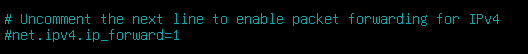
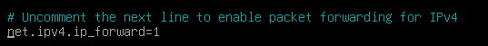
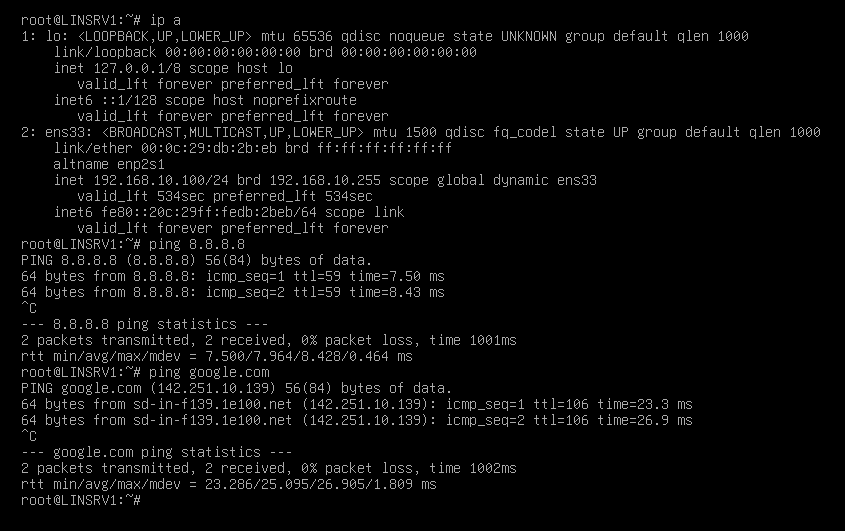

# setup NAT untuk Internet in FW
## FW-UTARA
- install iptables
  ```bash
  apt install iptables
  ```
- aktifkan ip forwarding
  ```nano /etc/sysctl.conf```
  cari baris ini
  
  dan uncommand baris ini menjadi seperti ini
  
- restart sysctl
  ```bash
  sudo sysctl -p
  ```
- setelah itu tambahkan nat ke interface bridge
  ```bash
  iptables -t nat -A POSTROUTING -o ens33 -j MASQUERADE
  ```

## LINSRV1, LINSRV2
- coba lakukan ping ke **8.8.8.8**, dan **google.com**
  

## FW-SELATAN
- lakukan hal yang sama dengan yang FW-UTARA

# setup firewall
```bash
comming soon
```