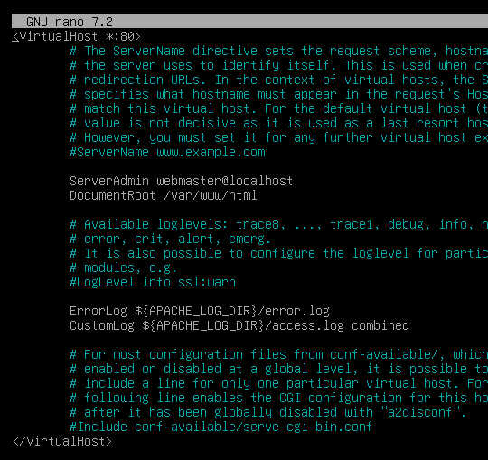
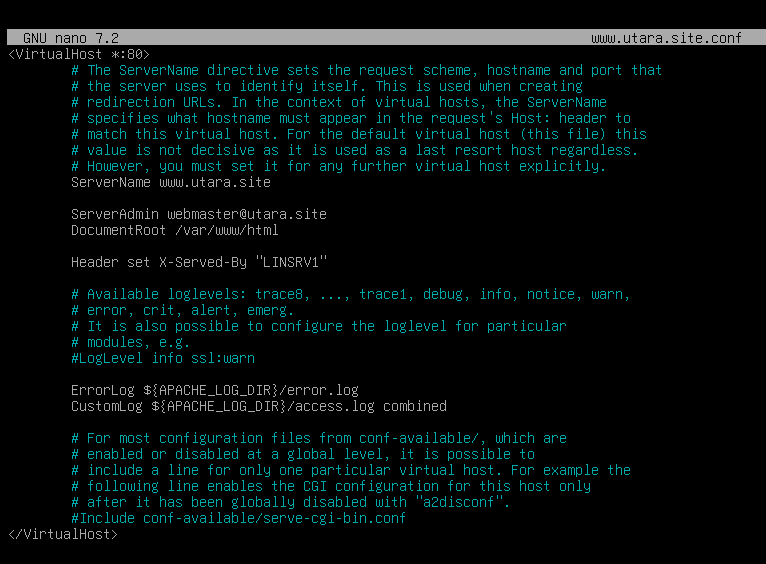

# LINSRV1
## web server
- install apache2
  ```bash
  apt install apache2
  ```
- ubah configurasinya
  ```bash
  cd /var/www/html
  echo "Hello World from utara site" > index.html

  cd /etc/apache2/sites-available/
  cp 000-default.conf www.utara.site.conf 
  nano www.utara.site.conf

  a2dissite 000-default.conf # disable default site
  a2ensite www.utara.site # enable utara.site
  a2enmod headers # enable modules headers
  a2query -s # list enable web
  ```

  sebelumnya \
  

  sesudahnya \
  

- restart apache2
  ```bash
  systemctl enable --now apache2
  systemctl restart apache2
  ```
- test
  ```bash
  apt install curl
  curl -v www.utara.site # atau gunakan ip jika blm set dns server
  # harus muncul header X-Served-By LINSRV1, dan element html "Hello World from utara site"
  ```

# LINSRV2
## CERTIFICATE AUTHORITY 
- Buat direktori CA
  ```bash
  mkdir -p /root/ca/{certs,crl,newcerts,private}
  chmod 700 /root/ca/private

  touch /root/ca/index.txt # Digunakan oleh OpenSSL untuk mencatat semua sertifikat yang telah dikeluarkan (issued).
  echo 1000 > /root/ca/serial

  cd /root/ca
  ```
- Buat file konfigurasi OpenSSL (optional): Kalau ingin lebih rapi, simpan sebagai ```/root/ca/openssl.cnf.```
- Buat Root Key dan Certificate
  ```bash
  openssl genrsa -aes256 -out private/cacert.key 4096
  chmod 400 private/cacert.key

  openssl req -x509 -new -nodes -key private/cacert.key -sha256 -days 3650 -out cacert.pem \
  -subj "/C=ID/O=LKS Jawa Barat/CN=Jabar 2024 CA"
  ```
- Buat sertifikat tambahan (misal untuk mail.utara.site)
  ```bash
  # Buat key dan CSR
  openssl genrsa -out mail.utara.site.key 2048
  openssl req -new -key mail.utara.site.key -out mail.utara.site.csr \
  -subj "/C=ID/O=LKS Jawa Barat/CN=mail.utara.site"

  # Tandatangani CSR dengan CA
  openssl x509 -req -in mail.utara.site.csr -CA cacert.pem -CAkey private/cacert.key \
  -CAcreateserial -out mail.utara.site.crt -days 365 -sha256
  ```
- Ulangi untuk www.utara.site, file.utara.site, dan www.selatan.site.

## WEB SERVER
- install nginx
  ```bash
  apt install nginx
  ```
- Konfigurasi nginx untuk www.utara.site
  ```bash
  cat <<EOF > /etc/nginx/sites-available/www.utara.site
  server {
      listen 80;
      server_name www.utara.site;

      location / {
          add_header X-Served-By "\$hostname";
          return 200 'Hello World from utara site';
      }
  }
  EOF
  ln -s /etc/nginx/sites-available/www.utara.site /etc/nginx/sites-enabled/
  ```
- Konfigurasi HTTPS untuk file.utara.site
  ```bash
  mkdir -p /data/file
  echo "File Server Content" > /data/file/index.html

  cat <<EOF > /etc/nginx/sites-available/file.utara.site
  server {
      listen 80;
      server_name file.utara.site;
      return 301 https://\$host\$request_uri;
  }

  server {
      listen 443 ssl;
      server_name file.utara.site;

      ssl_certificate /root/ca/file.utara.site.crt;
      ssl_certificate_key /root/ca/file.utara.site.key;
      ssl_client_certificate /root/ca/cacert.pem;

      location / {
          root /data;
          autoindex on;
          auth_basic "Restricted Content";
          auth_basic_user_file /etc/nginx/.htpasswd;
      }
  }
  EOF

  ln -s /etc/nginx/sites-available/file.utara.site /etc/nginx/sites-enabled/
  ```
- Tambahkan Basic Auth
  ```bash
  apt install apache2-utils -y
  htpasswd -cb /etc/nginx/.htpasswd rahasia Skills39s
  ```
- Restart nginx
  ```bash
  nginx -t && systemctl reload nginx
  ```
- Tambahan: Akses dari LINCLT tanpa warning
  ```bash
  cp /root/ca/cacert.pem /usr/local/share/ca-certificates/jabar2024.crt
  update-ca-certificates
  ```