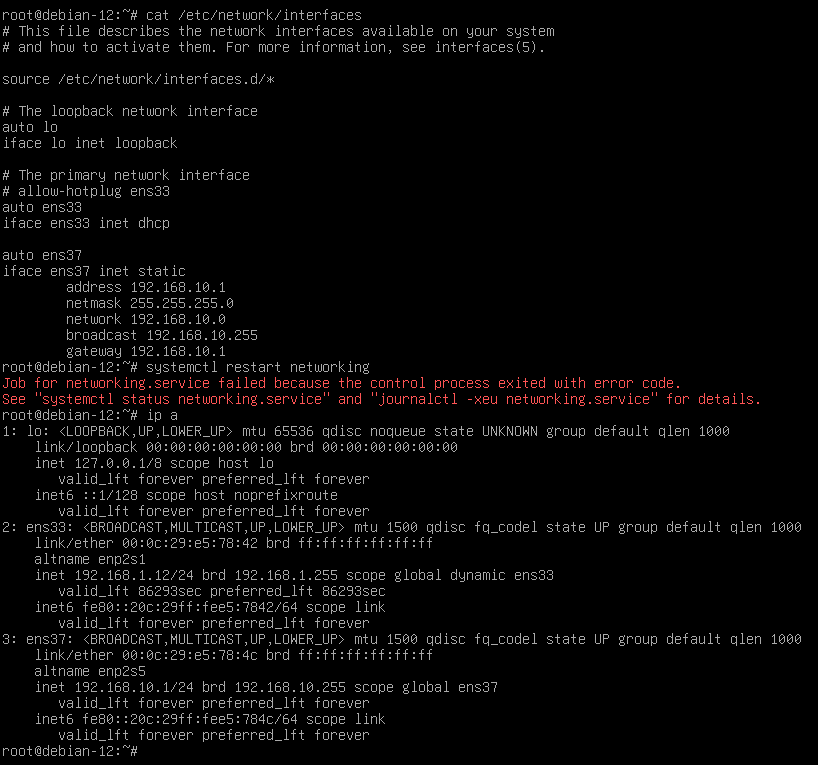
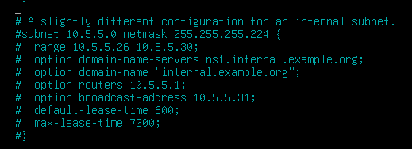
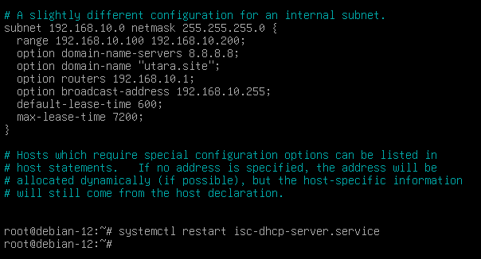
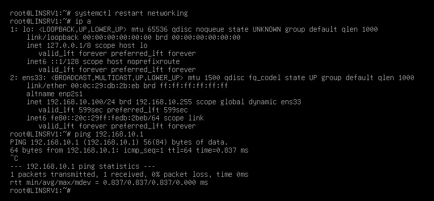

# setup dhcp server
## FW-UTARA
### ubah ip address di interface subnet lan
- ubah ip untuk adaptor 2 terlebih dahulu
  ```bash
  vi /etc/network/interfaces
  ```
- tambahkan bagian ini (sesuaikan **ens37** dengan interface yang kalian miliki bisa kalian cek dulu pake **ip a**)
  ```bash
  auto ens37
  iface ens37 inet static
      address 192.168.10.1
      netmask 255.255.255.0
      network 192.168.10.0
      broadcast 192.168.10.255
      gateway 192.168.10.1
  ```
- setelah itu restart network nya
  ```bash
  systemctl restart networking
  ```
- begini lah tampilanya

> disini terlihat error namun tetap dapat ip saya juga tidak tahu kenapa tapi selama dpt ip dan bisa terhubung lanjutin aja dulu

### setup isc dhcp server
- install isc-dhcp-server 
  ```bash
  apt install isc-dhcp-server
  ```
- setup interface dhcp server \
  ```nano /etc/default/isc-dhcp-serve``` \
  ubah bagian ini \
  ```bash
  INTERFACESv4="<ens37>"
  ```
- configurasikan dhcp server \
  ```nano /etc/dhcp/dhcpd.conf``` \
  cari baris ini \
  
  uncommant semuanya dan ubah sesuai dengan network yang kita gunakan
  
- tambahkan dhcp static
  ```bash
  host client-pc {
    hardware ethernet 08:00:27:4a:2f:45;  # MAC address client
    fixed-address 192.168.1.100;          # IP yang akan diberikan
  }
  ```
- lakukan restart dengan perintah ```systemctl restart networking```

### LINSRV1
```bash
```

## LINCLI
- setelah itu tinggal coba lakukan restart networking, atau dhclient agar client LINSRV1, dan LINSRV2 dapat ip
  ```bash
  systemctl restart networking
  ```
   \
  atau gunakan ini, hanya saja nanti akan dpt 2 ip (opsional) \
  ```bash
  dhclient
  ```

## LINSRV1
- ubah ip static

## LINSRV2
- ubah ip dhcp

## FW-SELATAN
### ubah ip address di interface subnet lan
- ubah ip untuk adaptor 2 terlebih dahulu
  ```bash
  vi /etc/network/interfaces
  ```
- tambahkan bagian ini (sesuaikan **ens37** dengan interface yang kalian miliki bisa kalian cek dulu pake **ip a**)
  ```bash
  auto ens37
  iface ens37 inet static
      address 172.16.20.1
      netmask 255.255.255.0
      network 172.16.20.0
      broadcast 172.16.20.255
      gateway 172.16.20.1
  ```
- setelah itu restart network nya
  ```bash
  systemctl restart networking
  ```