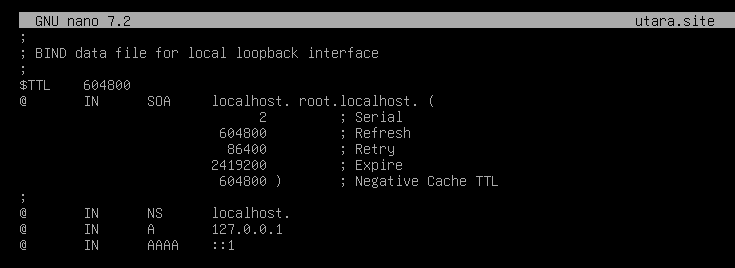
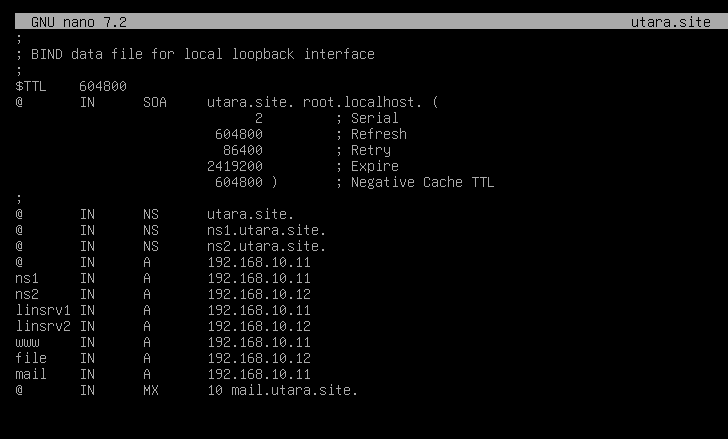
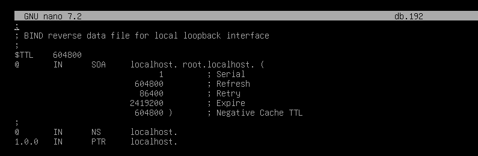
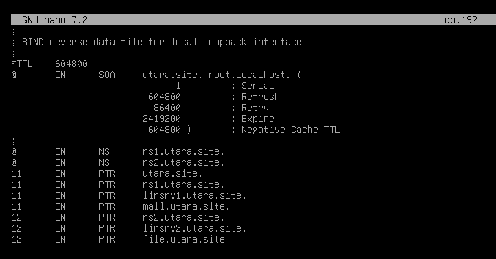
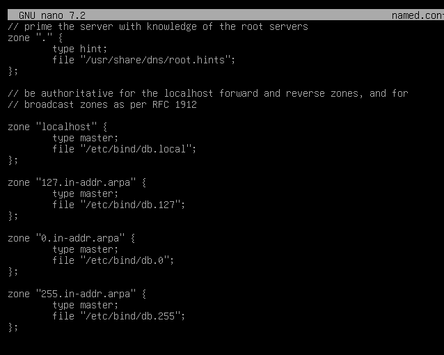
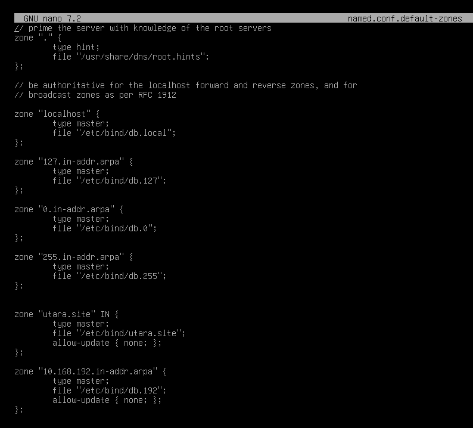
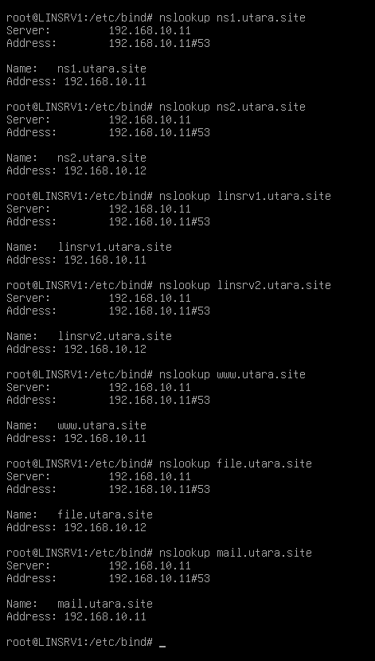

# setup dns server
## LINSRV1
- install package
  ```bash
  apt install bind9
  ```

- copy configurasi default
  ```bash
  cd /etc/bind
  cp db.local utara.site
  cp db.127 db.192
  cp named.conf.default-zones named.conf.default-zones.bak
  ```

- ubah utara.site
  ```nano utara.site``` \
  sebelumnya \
  

  sesudahnya \
  

- ubah db.192
  ```nano db.192``` \
  sebelumnya \
  

  sesudahnya \
  

- ubah named.conf.default-zones
  ```nano named.conf.default-zones``` \
  sebelumnya \
  

  sesudahnya \
  

- aktifkan service nya
  ```bash
  chown -R :bind .

  systemctl enable --now named
  systemctl restart named
  ```

### verifikasi
 \
```bash
# masukin ip dns server
nano /etc/resolv.conf
##
nameserver 192.168.10.11 ### masukin ip dns servernya
##

nslookup ns1.utara.site
nslookup ns2.utara.site

nslookup linsrv1.utara.site
nslookup linsrv2.utara.site

nslookup file.utara.site
nslookup www.utara.site
nslookup mail.utara.site
```