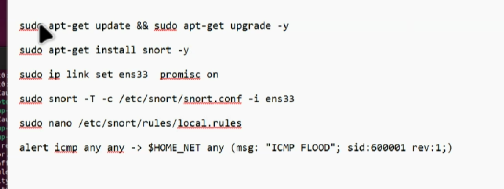

# snort


```bash
apt update
apt install snort -y
# Address range for the local network: 192.168.1.0/24

ip a
ip link set ens33 promisc on

nano /etc/snort/snort.conf
## ubah IPVAR nya

snort -T -c /etc/snort/snort.conf -i ens33
snort -q -A console -c /etc/snort/snort.conf -i ens33
```

## comunity rules
```bash
cd /etc/snort/rules
wget https://www.snort.org/downloads/community/community-rules.tar.gz
tar -xvzf community-rules.tar.gz

snort -q -A console -c /etc/snort/snort.conf -i ens33
```

## libdaq
```bash
sudo apt update
sudo apt install -y build-essential libpcap-dev libpcre3-dev libdumbnet-dev bison flex zlib1g-dev liblzma-dev openssl libssl-dev pkg-config libnetfilter-queue-dev


```

## icmp rules
```bash
# Alert untuk semua ICMP echo request (ping)
alert icmp any any -> any any (msg:"ICMP Echo Request Detected"; itype:8; sid:1000001; rev:1;)

# Reject ICMP dari 192.168.1.100 (anggap IP attacker)
reject icmp 192.168.1.100 any -> any any (msg:"Blocked ICMP from attacker"; sid:1000002; rev:1;)
```